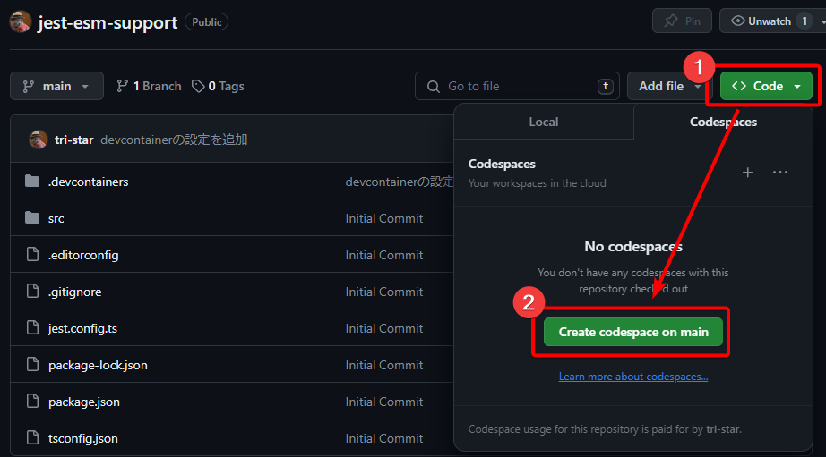

# NativeESM のパッケージ(middy v5+)を含むプロジェクトで jest.mock が利用できない問題の対処

## 確認方法

### Codespace

`Code > Create codespace` ボタンを押下し、VSCode が起動するのを待ちます。



### ローカルに Clone

Clone 後、以下のコマンドを実行します。

```
npm ci
```
